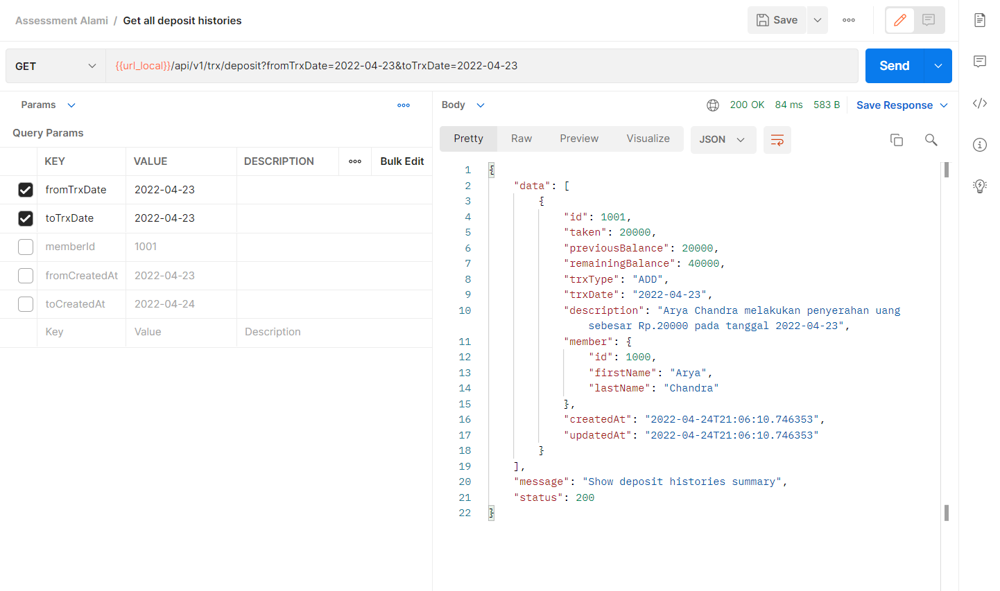

## Deposit and Installment Rest API

A simple rest api for Alami technical test assesment. \
ERD design of this application can be found at [here.](https://drive.google.com/file/d/1rqgQQqWPPYn50BVTk2Ip4HFJtX5z1bBx/view?usp=sharing)

### Dokumentasi API :

#### Daftar API yang digunakan untuk mengelola anggota kelompok simpan-pinjam

| Path                      | Method | Deskripsi                             |
| ---                       | -----  | ----                                  |
| /api/v1/registration      | POST   | Untuk mendaftarkan anggota            |
| /api/v1/members           | GET    | Untuk melihat semua daftar anggota    |

#### 1. Pendaftaran anggota
  * Path : /api/v1/registration
  * Method     : POST
  * Body :

    | Name        | Tipe     | Deskripsi       |
    | ---         | -----    | ----              |
    | firstName   | string   | Nama depan dari anggota, minimal 3 kata  |
    | lastName    | string   | Nama belakang dari anggota, minimal 3 kata |
    | dob         | string   | Tanggal lahir anggota, dengan format yyyy-MM-dd  |
    | address     | string   | Alamat dari anggota  |
    
  * Contoh response
    

#### 2. Menampilkan daftar anggota
  * Path : /api/v1/members
  * Method     : GET
  * Parameter : Tidak tersedia
  * Contoh response
    

#### Daftar API yang digunakan untuk melakukan transaksi simpan-pinjam

| Path                      | Method | Deskripsi                             |
| ---                       | -----  | ----                                  |
| /api/v1/deposit           | GET    | Digunakan untuk menampilkan daftar dana simpanan anggota    |
| /api/v1/deposit/:id       | GET    | Digunakan untuk menampilkan dana simpanan berdasarkan ID    |
| /api/v1/loan              | GET    | Digunakan untuk menampilkan daftar pinjaman anggota    |
| /api/v1/loan/:id          | GET    | Digunakan untuk menampilkan data pinjaman berdasarkan ID    |
| /api/v1/trx/deposit       | POST   | Digunakan untuk menyimpan atau mengambil dana simpanan        |
| /api/v1/trx/loan          | POST   | Digunakan untuk melakukan pinjaman dana    |
| /api/v1/trx/loan/payment  | POST   | Digunakan untuk pembayaran pinjaman    |

#### 1. Menampilkan daftar data simpanan anggota
  * Path : /api/v1/deposit
  * Method     : GET
  * Params :

    | Name        | Tipe     | Deskripsi       |
    | ---         | -----    | ----              |
    | memberId    | string   | Untuk memfilter daftar dana simpanan berdasarkan id anggota  |
    
  * Contoh response
    

#### 2. Menampilkan data simpanan berdasarkan ID
  * Path : /api/v1/deposit/:id
  * Method     : GET
  * Params Path :

    | Name        | Tipe     | Deskripsi       |
    | ---         | -----    | ----              |
    | id          | long     | Untuk spesifik menampilkan data simpanan berdasarikan id simpanan  |
    
   * Contoh response
     

#### 3. Menampilkan daftar data pinjaman anggota
  * Path : /api/v1/loan
  * Method     : GET
  * Params :

    | Name        | Tipe     | Deskripsi       |
    | ---         | -----    | ----              |
    | memberId    | string   | Untuk memfilter daftar pinjaman berdasarkan id anggota  |
    
  * Contoh response
    

#### 4. Menampilkan data pinjaman berdasarkan ID
  * Path : /api/v1/loan/:id
  * Method     : GET
  * Params Path :

    | Name        | Tipe     | Deskripsi       |
    | ---         | -----    | ----              |
    | id          | string   | Untuk spesifik menampilkan data pinjaman berdasarikan id pinjaman  |
    
  * Contoh response
    

#### 5. Menyimpan atau mengambil dana simpanan
  * Path : /api/v1/trx/deposit
  * Method     : POST
  * Body :

    | Name        | Tipe     | Deskripsi       |
    | ---         | -----    | ----              |
    | taken       | int      | Sebagai nilai untuk menyimpan atau mengambil dana, misalkan `500000`  |
    | memberId    | string   | Merupakan id anggota yang akan melakukan transaksi tersebut  |
    | trxType     | string   | Sebagai penanda bahwa itu untuk penyimpanan atau pengambilan dana, gunakan value `ADD` untuk menyimpan dana atau `TAKEN` untuk mengambil dana |
    | trxDate     | string   | Tanggal dilakukannya transaksi tersebut, bernilai `yyyy-MM-dd`  |
    
  * Contoh response
    

#### 6. Melakukan pinjaman dana
  * Path : /api/v1/trx/loan
  * Method     : POST
  * Body :

    | Name        | Tipe     | Deskripsi       |
    | ---         | -----    | ----              |
    | amount      | int      | Jumlah dana yang akan dipinjam, misalkan `1000000`  |
    | memberId    | string   | Merupakan id anggota yang akan melakukan transaksi tersebut  |
    | trxDate     | string   | Tanggal dilakukannya transaksi tersebut, bernilai `yyyy-MM-dd`  |
    
  * Contoh response
    

#### 7. Melakukan pembayaran pada pinjaman
  * Path : /api/v1/trx/loan/payment
  * Method     : POST
  * Body :

    | Name        | Tipe     | Deskripsi       |
    | ---         | -----    | ----              |
    | amount      | int      | Jumlah dana yang akan dibayarkan untuk membayar pinjaman  |
    | loanId      | string   | Merupakan id dari pinjaman yang akan dibayarkan tersebut  |
    | trxDate     | string   | Tanggal dilakukannya transaksi tersebut, bernilai `yyyy-MM-dd`  |
    
  * Contoh response
    

#### Daftar API yang digunakan untuk melihat history transaksi

| Path                      | Method | Deskripsi                             |
| ---                       | -----  | ----                                  |
| /api/v1/trx/deposit       | GET    | Digunakan untuk menampilkan daftar riwayat transaksi simpanan   |
| /api/v1/trx/loan          | GET    | Digunakan untuk menampilkan daftar riwayat transaksi pinjaman    |

#### 1. Menampilkan daftar riwayat transaksi simpanan
  * Path : /api/v1/trx/deposit
  * Method     : GET
  * Params :

    | Name        | Tipe     | Deskripsi       |
    | ---         | -----    | ----              |
    | memberId    | string   | Untuk memfilter riwayat transaksi berdasarkan id dari anggota  |
    | fromTrxDate | string   | Untuk memfilter range awal dari tanggal dilakukannya transaksi, bernilai `yyyy-MM-dd` |
    | toTrxDate   | string   | Untuk memfilter range akhir dari tanggal dilakukannya transaksi, bernilai `yyyy-MM-dd`  |
    | fromCreatedAt | string   | Untuk memfilter range awal dari tanggal dibuatnya data transaksi, bernilai `yyyy-MM-dd` |
    | toTrxDate   | string   | Untuk memfilter range akhir dari tanggal dibuatnya data transaksi, bernilai `yyyy-MM-dd`  |
    
  * Contoh response
    
  * 

#### 2. Menampilkan daftar riwayat transaksi pinjaman
  * Path : /api/v1/trx/loan
  * Method     : GET
  * Params :

    | Name        | Tipe     | Deskripsi       |
    | ---         | -----    | ----              |
    | memberId    | string   | Untuk memfilter riwayat transaksi berdasarkan id dari anggota  |
    | fromTrxDate | string   | Untuk memfilter range awal dari tanggal dilakukannya transaksi, bernilai `yyyy-MM-dd` |
    | toTrxDate   | string   | Untuk memfilter range akhir dari tanggal dilakukannya transaksi, bernilai `yyyy-MM-dd`  |
    | fromCreatedAt | string   | Untuk memfilter range awal dari tanggal dibuatnya data transaksi, bernilai `yyyy-MM-dd` |
    | toTrxDate   | string   | Untuk memfilter range akhir dari tanggal dibuatnya data transaksi, bernilai `yyyy-MM-dd`  |
    
  * Contoh response
    
* 
